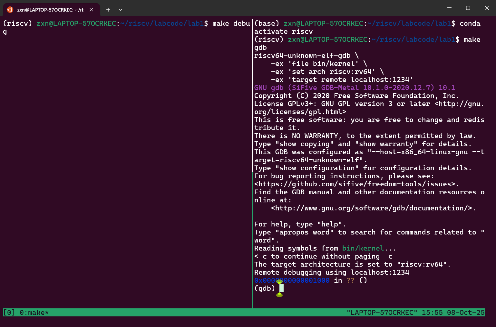
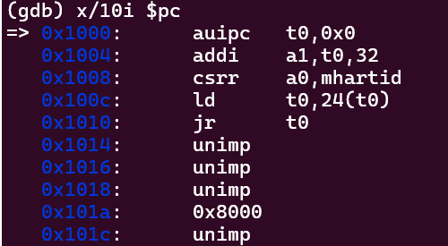
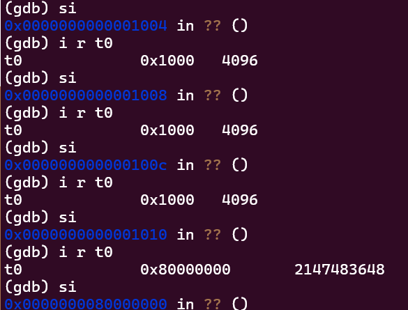
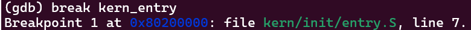
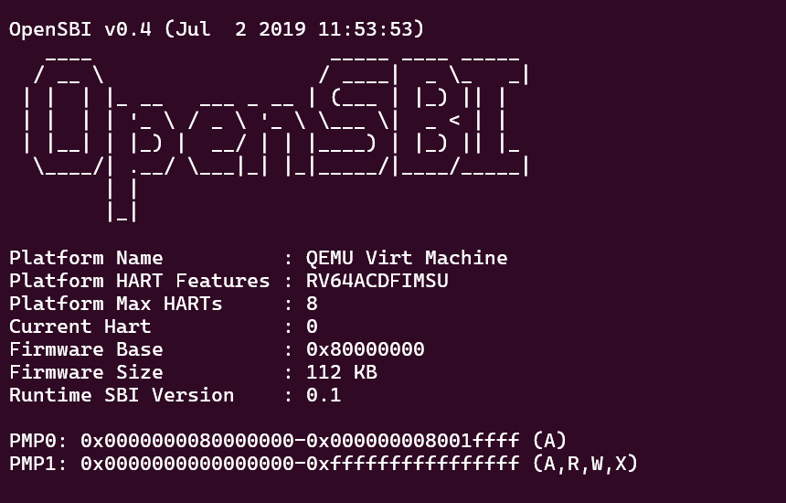
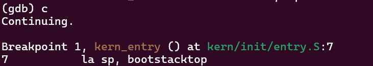
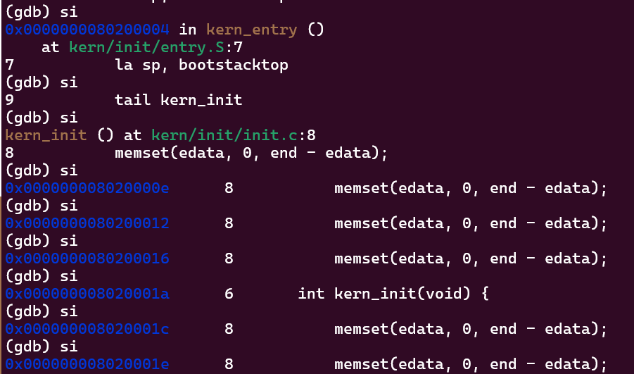
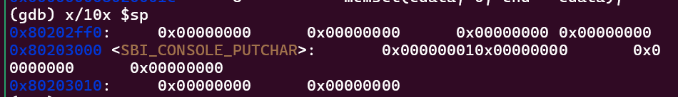
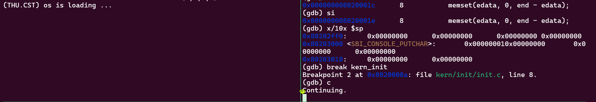

# **lab1**
小组成员：朱欣宁（2313686） 雷雨彦（2313894） 宁宇嫣（2313123）
## **练习一**
**kern/init/entry.S** 文件内容如下：
```C
#include <mmu.h>
#include <memlayout.h>

    .section .text,"ax",%progbits
    .globl kern_entry
kern_entry:
    la sp, bootstacktop

    tail kern_init

.section .data
    # .align 2^12
    .align PGSHIFT
    .global bootstack
bootstack:
    .space KSTACKSIZE
    .global bootstacktop
bootstacktop:
```
- `la sp, bootstacktop`：`la`是伪指令，全称`load address` ，其功能是将栈指针设置为内核栈的顶部地址，为C代码执行建立栈环境。

- `tail kern_init`：以尾调用方式跳转到内核初始化函数，开始执行C语言主代码。


## **练习二**
### **调试过程**
此实验过程中我们需要打开两个终端，在左边窗格中，输入make debug ，这个命令会启动QEMU，在右边窗格，我们输入make gdb。


我们输入以下指令来得到当前执行的地址：
```gdb
(gdb) i r pc
```
输出如下：


说明RISC-V 加电后执行的第一条指令位于 0x1000。

输入指令`x/10i$pc`查看即将执行的10条汇编指令：


观察可知在地址为0x1010的指令处会跳转。

输入`si`单步执行，使用形如`info r t0`的指令查看涉及到的寄存器结果：


在目标函数`kern_entry`的第一条指令处设置断点，输出如下：



输入`c`（即continue指令）执行直到断点，左边窗格的debug输出如下：


而右边窗格的gdb输出如下：


在 kern_entry 处停下后，我们输入几次 si，观察汇编指令的逐条执行情况：

这个执行序列完美展示了内核启动初期的两个关键阶段：
- 环境搭建 ：设置栈指针。
- 初始化：进入C世界，首先清理BSS段，为全局变量提供确定的初始状态

然后输入 x/10x $sp，看看栈初始化前的内存里到底是什么：

这些数据说明栈已就绪但尚未使用，SBI服务已配置完成，准备为内核提供硬件服务，且内存布局正确，为内核执行做好了准备。

我们在`kern_init` 处打上第二个断点，然后输入`c`执行直到断点：

debug窗口显示代码已经陷入循环。


### **问题解答**
- 通过GDB调试可知，RISC-V 硬件加电后最初执行的几条指令位于0x1000位置。
- 完成的功能如下：
  - `0x1000: auipc t0, 0x0`：将当前PC值的高20位存入t0，获取代码的基地址。
  - `0x1004: addi a2, t0, 40`：计算并保存设备树在内存中的地址到a2寄存器。
  - `0x1008: csrr a0, mhartid`：读取当前CPU核的硬件ID并存入a0寄存器。
  - `0x100c: ld t0, 24(t0)`：从内存中加载要跳转的目标地址到t0寄存器。
  - `0x1010: jr t0`：跳转到t0寄存器指定的地址，将控制权交给下一阶段。


## **OS实验与原理知识点对应**

### **1. 系统启动流程（Boot Process）**
- **实验内容**：
  - QEMU 模拟 RISC-V 启动流程：复位 → 执行 OpenSBI（M 模式）→ 加载内核到 0x80200000 → 跳转到内核入口 `kern_entry`。
  - 使用 OpenSBI 作为 bootloader，负责初始化硬件并加载内核。
- **OS 原理对应**：
  - 系统启动流程（BIOS/UEFI → Bootloader → Kernel）。
  - 特权级切换（M-mode → S-mode）。
- **关系与差异**：
  - 实验中的 OpenSBI 类似于 PC 中的 BIOS/UEFI，负责最底层的硬件初始化。
  - 差异：实验中使用的是 RISC-V 架构和 QEMU 模拟环境，而原理中通常是 x86 架构。

### **2. 内存布局与链接脚本（Memory Layout & Linker Script）**
- **实验内容**：
  - 使用 `kernel.ld` 链接脚本指定内核的加载地址（0x80200000）和段布局（`.text`, `.data`, `.bss`, `.rodata` 等）。
  - 明确指定入口点为 `kern_entry`。
- **OS 原理对应**：
  - 程序的内存分段（代码段、数据段、BSS 段、栈、堆）。
- **关系与差异**：
  - 实验中的链接脚本是 “程序内存布局” 原理的直接实现工具 —— 通过脚本强制内核各段加载到指定地址（如 0x80200000 开始），符合原理中 “内核需加载到固定地址以保证指令地址相关性” 的要求。
  - 同时，脚本对段的划分（`.text`/`.rodata` 等）遵循原理中 “按功能划分内存区域” 的逻辑。

### **3. 内核初始化与运行环境准备**
- **实验内容**：
  - `entry.S` 中设置栈指针 `sp`，跳转到 `kern_init`。
  - 在 `kern_init` 中清空 `.bss` 段，调用 `cprintf` 输出信息。
- **OS 原理对应**：
  - 内核初始化流程（设置栈、清 BSS、初始化设备等）。
  - C 语言运行环境的准备。
- **关系与差异**：
  - 实验展示了在没有标准库的情况下如何手动准备 C 环境。
  - 原理中这些步骤通常由启动代码（`crt0`）自动完成。

### **4. 系统调用与特权级切换**
- **实验内容**：
  - 通过 `ecall` 指令调用 OpenSBI 服务。
  - 使用内联汇编封装 `sbi_call` 函数。
- **OS 原理对应**：
  - 系统调用机制（`syscall`）。
  - 特权级切换（用户态 → 内核态）。
- **关系与差异**：
  - 实验中的 `ecall` 实现了从 S-mode 到 M-mode 的切换，类似于 `syscall` 实现从用户态到内核态的切换。
  - 差异在于：实验中使用的是 RISC-V 的 M-mode，而原理中通常是 U-mode 到 S-mode。

### **5. 输出与调试机制**
- **实验内容**：
  - 通过 OpenSBI 服务实现字符输出。
  - 实现 `cprintf` 格式化输出函数。
  - 使用 GDB 远程调试内核。
- **OS 原理对应**：
  - 设备驱动（控制台输出）。
  - 内核调试方法。
- **关系与差异**：
  - 实验通过封装底层输出服务，逐步构建出格式化输出功能。
  - 原理中输出通常由内核驱动直接控制硬件或调用 BIOS 中断。

### **OS原理重要知识点**
| 类别 | 原理知识点 |
|------|------------|
| **进程与线程管理** | 进程控制块与进程状态切换 |
| | CPU调度算法 |
| **内存管理** | 虚拟内存与页表机制 |
| | 动态内存分配 |
| **I/O与设备管理** | 中断处理与中断控制器 |
| | 设备驱动程序架构 |
| **文件系统** | 文件系统结构与实现 |
| **并发控制** | 死锁检测与避免 |
| | 同步与互斥机制 |

## **总结与思考**
通过本次实验，我们的内核能够正确对接到 Qemu 模拟器上，了解了 Qemu 模拟器的启动流程，也学习到一些程序内存布局和编译流程的相关知识。

此次实验内容是OS原理的基础——操作系统本身是如何被构建和启动的，系统软件之间的依赖关系和协作机制和硬件与软件之间的精确对接要求。